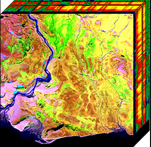
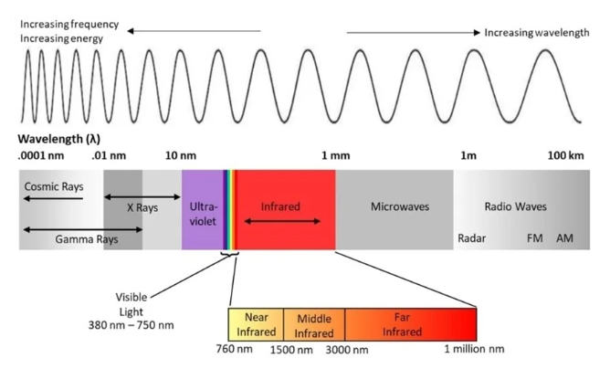

# Deep-Learning-for-Hyperspectral-Image-Classification
Deep learning architectures for classifying hyperspectral images 

An example of a hyperspectral datab cube projected into 2 dimensions. 

A depiction of the electromagnetic (EM) spectrum. 

The hyperspectral sensor collects from the visible to the near-infrared.
Each pixel in the dataset is a high-dimensional vector, the entries of which are the spectral reflectance at a given wavelength. 

The Pavia Hyperspectral dataset (https://www.kaggle.com/datasets /syamkakarla/pavia-university-hsi) was collected over 
Italy using the ROSIS hyperspectral sensor, providing 103 spectral bands over 610x340 pixels. with a 1.3 meter spatial resolution. 
9 ground truth classes are represented in the dataset. See https://www.kaggle.com/datasets/syamkakarla/pavia-university-hsi for more details.